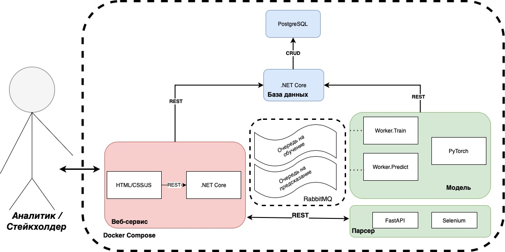

# AvanPost Challeng. Решение команды MISIS_AI_Lab на трек 1

В данном репозитории находится решение команды MISIS_AI_Lab. Никакие наработки до хакатона не использовались, продукт был создан только за время хакатона
## Содержание

- [AvanPost Challeng. Решение команды MISIS\_AI\_Lab на трек 1](#avanpost-challeng-решение-команды-misis_ai_lab-на-трек-1)
  - [Содержание](#содержание)
  - [Описание решения](#описание-решения)
  - [Инструкция по запуску](#инструкция-по-запуску)
    - [Локальный запуск](#локальный-запуск)
  - [Архитектура](#архитектура)
  - [Паттерны и Референсная Архитектура](#паттерны-и-референсная-архитектура)
    - [Референсная Архитектура](#референсная-архитектура)
    - [Паттерны](#паттерны)
  - [Контакты](#контакты)
  
## Описание решения

Нашим решением является веб портал с наиболее актуальной информацией. На нем можно осуществить следующие действия:

- Запуск обучения модели
- Загрузка данных из публичных источников для обучения
- Возможность вручную добавить данные в обучающую выборку
- Выбор выборки для обучения

## Инструкция по запуску

Фронтенд нашего сервиса доступен по ссылке:  
[51.250.88.247](http://51.250.88.247) 

Однако, есть возможность развернуть локально.

### Локальный запуск

Перед тем, как развернуть у себя сервис необходим [Docker](https://docs.docker.com/get-docker/) и [Docker Compose](https://docs.docker.com/compose/install).

Если требование выполнено, то выполните 3 простых действия:

1. Склонируйте этот репозиторий
2. Зайдите в корневую директорию проекта и запустите следующую команду:

    docker-compose up -d
3. Используйте развернутые приложения
   - **frontend:80** - адрес фронтенда
   - **server:8090** - адрес сервиса отправки в RabbitMQ
   - **database:27017-27019** - адрес базы данных
   - **broker:15672** - адрес RabbitMQ
## Архитектура
На диаграмме ниже можно посмотреть на верхнеуровневую архитектуру нашего сервиса.

## Паттерны и Референсная Архитектура

В рамках работы над прототипом были учтены лучшие практики построения подобных решений. В качестве главного архитектурного принципа были выбрана несколько:

- **Обеспечить минимальное время ожидания для пользователя**
- **Необходимость отделить бизнес логику веб сервиса от ресурсоемких задач Машинного Обучения**

В этой связи мы опираемся на референсные архитектуры ведущих ИТ компаний, а также используем общеприщнанные паттерны, проверенные временем.

### Референсная Архитектура

В качестве референсных архитектур мы взяли подход IBM в построении решений [AI for IT Operations (AIOps)](https://www.ibm.com/cloud/architecture/architectures/sm-aiops/reference-architecture), из которого мы поняли, что разбиение процесса на этапы (Collect, Organize, Analyze, Infuse) соответствуют нашим потребноостям.

### Паттерны

Что касается паттернов, то мы используем два довольно популярных паттерна:

- [Микросервисная архитектура](https://microservices.io/patterns/microservices.html). Каждый сервис может быть развернут отдельно, а большинство коммуникаций - через REST API запросы.
- [Database per service](https://microservices.io/patterns/data/database-per-service.html). Поскольку база данных используется в нескокльких местах, мы приняли решение выделить отдельный микросервис для обспечения Create, Read, Update, Delete (CRUD) запросов

## Контакты

В случае возникновения каких-либо ошибок или вопросов не стесняйтесь создавать Issue в репозитории. Также можете писать в личные сообщения @misisailab (Telegram, VK) или на почту misisailab@misis.ru
  